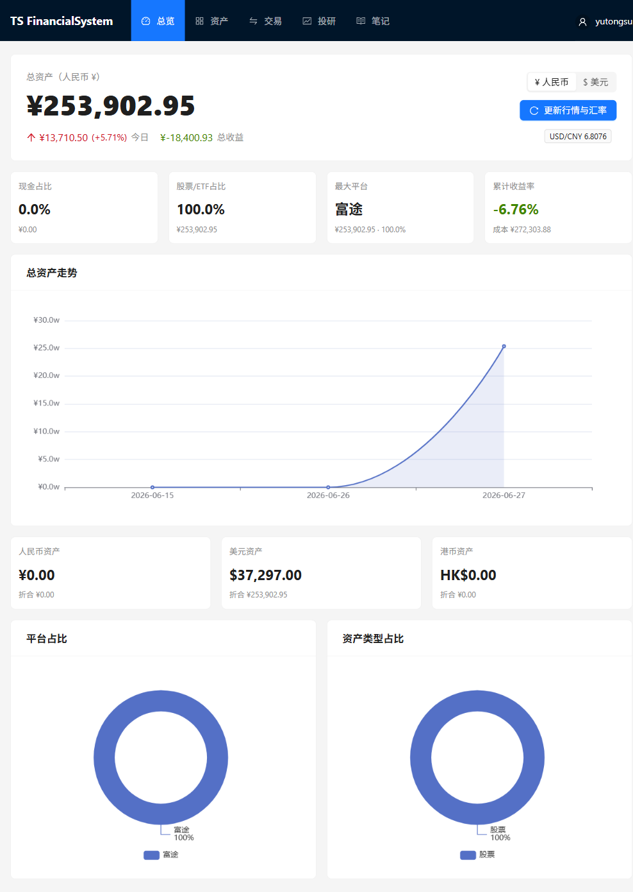
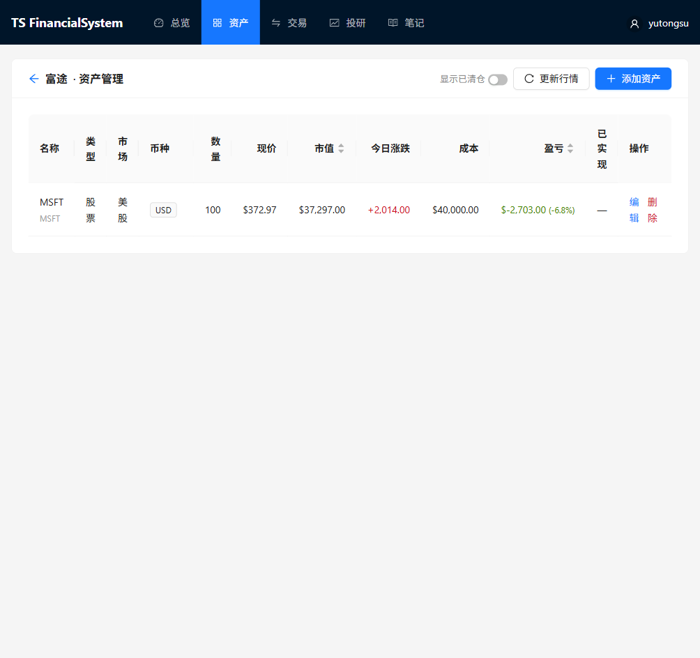

# TSFinancialSystem

<div align="center">

**A self-hosted portfolio and investment research system for multi-currency personal assets.**

[Live Site](https://tsfinancialsystem.fly.dev/) ·
[中文](README.zh-CN.md) ·
[Architecture](ARCHITECTURE.md) ·
[Changelog](CHANGELOG.md)

[](https://www.python.org/)
[](https://fastapi.tiangolo.com/)
[](https://react.dev/)
[](https://vitejs.dev/)
[](https://ant.design/)
[](Dockerfile)
[](LICENSE)

</div>

## What It Does

TSFinancialSystem helps you track stocks, funds, bonds, crypto, and cash in one private web app — organized by brokerage account and currency, with live quotes, USD/CNY FX conversion, transaction-driven holdings, net-worth charts, allocation views, and AI-assisted research reports.

Designed for investors who want a clear personal finance cockpit without handing their portfolio data to a third-party SaaS.

## Live Demo

**<https://tsfinancialsystem.fly.dev/>**

Open registration. Multi-user, fully isolated data, HTTPS via Fly.io.

## Screenshots

| Dashboard | Platform Detail |
| --- | --- |
|  |  |

## Feature Highlights

| Area | What you get |
| --- | --- |
| Portfolio dashboard | Total assets, daily change, total return, unrealized / realized P&L, dividend income, and net-worth trend chart |
| Global display currency | Switch between USD and CNY globally — all pages, P&L, and charts update instantly; choice persists across sessions |
| Multi-currency assets | CNY, USD, and HKD holdings; FX-converted amounts follow the display currency you set |
| Platform-based tracking | Group assets by brokerage or account (Futu, IBKR, Tiger, banks, wallets, or custom) |
| Live market data | A-share, HK, US, fund, crypto, and FX data through free data sources |
| Transaction-driven holdings | Buy / sell / dividend records auto-update quantity, weighted-average cost, realized P&L, and closed-position status |
| Manual assets | Cash, bonds, private funds, or any asset without a price API — enter market value directly |
| Investment journal | Write and manage notes for investment decisions, thesis tracking, and reviews |
| AI research workspace | One-click AI research reports using GPT, DeepSeek, GLM, or Claude; language-locked Chinese/English reports render with full Markdown (GFM tables, code blocks, blockquotes) |
| BYOK (Bring Your Own Key) | Each user configures personal AI API keys in Profile → AI Settings; no shared key required |
| Privacy & security | Amount masking, dark mode, email verification, password reset with security questions, per-user data isolation, JWT auth |
| Mobile-responsive | Hamburger drawer nav on small screens; forms, cards, and tables adapt to mobile widths |
| Self-hosted | One Docker image — FastAPI serves the compiled React frontend, SQLite persisted on a Fly.io volume |

## How It Works

1. Create accounts for your brokers, banks, or wallets.
2. Add holdings manually or record buy / sell / dividend transactions.
3. Refresh quotes and exchange rates on demand (or set auto-refresh on the dashboard).
4. Review total assets, allocation, and net-worth trend. Switch between USD and CNY display globally.
5. Write investment notes and launch AI-assisted research reports in Chinese or English.
6. Export a full JSON backup whenever you need it.

## Tech Stack

| Layer | Stack |
| --- | --- |
| Backend | FastAPI, SQLModel, SQLite, JWT auth, akshare, CoinGecko, OpenAI-compatible AI clients |
| Frontend | React 18, Vite, Ant Design 5, ECharts, React Router, Axios, react-markdown + remark-gfm |
| Infrastructure | Docker multi-stage build, Fly.io, persistent volume |
| Data | SQLite by default; `DATABASE_URL` available for future migration |

## Data Sources

| Data | Source | Notes |
| --- | --- | --- |
| A-share, HK, US stocks, on-market funds | akshare / Eastmoney snapshots | Free, usually delayed |
| Off-market funds | akshare fund NAV | Latest NAV by fund code |
| Crypto | CoinGecko free API | Common symbols and CoinGecko IDs |
| USD/CNY FX | open.er-api.com | Falls back to Bank of China data |

## Local Development

**Prerequisites:** Python 3.10+, Node.js 18+

```bash
git clone https://github.com/TomSu0808/TSFinancialSystem.git
cd TSFinancialSystem
python dev.py start
```

The launcher creates the backend virtual environment, installs dependencies, starts FastAPI and Vite, and opens the browser.

| Service | URL |
| --- | --- |
| Frontend | <http://localhost:5173> |
| Backend API | <http://localhost:8000> |
| API docs | <http://localhost:8000/docs> |

```bash
python dev.py stop   # stop dev servers
```

**Manual startup:**

```bash
# Backend
cd backend
python -m venv .venv
source .venv/bin/activate          # macOS/Linux
# .venv\Scripts\activate           # Windows
pip install -r requirements.txt
uvicorn main:app --reload
```

```bash
# Frontend (separate terminal)
cd frontend
npm install
npm run dev
```

## Configuration

Copy `backend/.env.example` to `backend/.env` for local development.

| Variable | Purpose |
| --- | --- |
| `SECRET_KEY` | JWT signing key — set a stable random value in production |
| `ENV` | `production` enables startup config checks |
| `DATA_DIR` | SQLite directory, e.g. `/data` on Fly.io |
| `DATABASE_URL` | Optional full database URL |
| `ALLOW_REGISTRATION` | Enable / disable public registration (default `true`) |
| `APP_BASE_URL` | Public URL for email verification and password-reset links (required in production) |
| `EMAIL_ENABLED` | `false` (default) prints verification links to the console; `true` sends real email via SMTP |
| `EMAIL_FROM` | Sender address |
| `SMTP_HOST` | SMTP server hostname |
| `SMTP_PORT` | SMTP port (default 587) |
| `SMTP_USERNAME` | SMTP username |
| `SMTP_PASSWORD` | SMTP password |
| `SMTP_TLS` | `true` for SSL/TLS; `false` for STARTTLS |
| `APP_ENCRYPTION_KEY` | **Required in production.** Fernet key for encrypting user API keys. Generate: `python -c "from cryptography.fernet import Fernet; print(Fernet.generate_key().decode())"`. Changing this key makes all saved user API keys unreadable. |
| `ALLOW_SYSTEM_AI_FALLBACK` | `false` (default): users must set their own key. `true`: fall back to the system key when a user has none. |
| `AI_PROVIDER` | Default AI provider: `gpt`, `deepseek`, `glm`, or `claude` |
| `DEEPSEEK_API_KEY` | System-level DeepSeek key |
| `OPENAI_API_KEY` | System-level OpenAI key |
| `GLM_API_KEY` | System-level GLM key |
| `ANTHROPIC_API_KEY` | System-level Claude key |
| `FX_REFRESH_INTERVAL_SECONDS` | USD/CNY cache TTL (default 21600 s) |

## Deploy to Fly.io

One Docker image — FastAPI serves the compiled React app, so frontend and backend are same-origin.

```bash
fly launch --no-deploy
fly volumes create data --size 1 --region nrt

# Required
fly secrets set ENV="production"
fly secrets set SECRET_KEY="replace-with-a-long-random-string"
fly secrets set APP_BASE_URL="https://your-app.fly.dev"

# BYOK encryption (required)
fly secrets set APP_ENCRYPTION_KEY="<your-fernet-key>" ALLOW_SYSTEM_AI_FALLBACK="false"

# System-level AI key (optional; only used when ALLOW_SYSTEM_AI_FALLBACK=true)
fly secrets set DEEPSEEK_API_KEY="your-key" AI_PROVIDER="deepseek"

# Email (optional; verification links appear in fly logs if not set)
fly secrets set EMAIL_ENABLED="true" \
  EMAIL_FROM="noreply@yourdomain.com" \
  SMTP_HOST="smtp.example.com" \
  SMTP_PORT="587" \
  SMTP_USERNAME="your-user" \
  SMTP_PASSWORD="your-password"

fly deploy
```

Local `.env` files are not uploaded to Fly.io. Production keys must be set with `fly secrets set`.

## Repository Map

```text
FinancialSystem/
├─ backend/
│  ├─ main.py                     FastAPI entrypoint and static frontend hosting
│  ├─ models.py                   SQLModel tables, schemas, and portfolio math
│  ├─ database.py                 Engine, DB init, and lightweight migrations
│  ├─ position.py                 Transaction replay and derived holding state
│  ├─ price_provider.py           Quote providers (akshare, CoinGecko)
│  ├─ fx_provider.py              USD/CNY exchange-rate providers
│  ├─ ai_client.py                GPT / DeepSeek / GLM / Claude client abstraction
│  ├─ research_prompt_builder.py  AI research prompt assembly with Markdown format rules
│  ├─ email_service.py            SMTP email (verification, password reset)
│  ├─ rate_limit.py               In-process sliding-window rate limiter
│  └─ routers/                    API route modules
├─ frontend/
│  └─ src/
│     ├─ App.jsx                  Layout, routing, and global settings context
│     ├─ displaySettings.jsx      Global display currency context + FX conversion helpers
│     ├─ colorScheme.jsx          Up/down color scheme context (red-up or green-up)
│     ├─ api/index.js             Axios API layer
│     └─ pages/                   Dashboard, Platforms, PlatformDetail, Transactions,
│                                 Research, Notes, Login
├─ Dockerfile                     Multi-stage Docker build
├─ fly.toml                       Fly.io deployment config
├─ dev.py                         Cross-platform dev launcher
├─ 01-dashboard.png               Dashboard screenshot
└─ 02-platform-detail.png         Platform detail screenshot
```

## Roadmap

- [x] Multi-user authentication with JWT
- [x] Docker and Fly.io deployment
- [x] Transaction-driven holdings (buy/sell/dividend → auto-update quantity, cost, P&L)
- [x] Investment journal
- [x] Backup and restore (full-account JSON)
- [x] Privacy mode and dark theme
- [x] AI-assisted research workspace (GPT, DeepSeek, GLM, Claude)
- [x] Markdown-rendered AI reports (GFM tables, code blocks, blockquotes)
- [x] Email verification, forgot/reset password, security-question recovery
- [x] BYOK — per-user AI API key management with encrypted storage
- [x] Global display currency (USD/CNY, persisted, synchronized across all pages)
- [x] Mobile-responsive layout (hamburger nav, adaptive forms, scrollable tables)
- [ ] Scheduled / automatic quote refresh
- [ ] PostgreSQL deployment option
- [ ] Broker API sync (Futu, IBKR, and others)

## Disclaimer

This project is for personal asset tracking and research logging. Market data and AI-generated content may be delayed, incomplete, or incorrect. Nothing here is financial advice.

## License

Released under the [MIT License](LICENSE).
